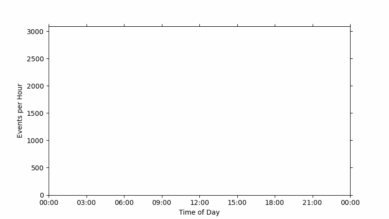

# BinPrism
Tools for fitting linear combinations of continuous basis functions to match binned data.

Often, data from continuous variables are placed into discrete bins. Large bins do not contain information on smaller bins making them difficult to disaggregate, but small bins are more prone to errors due to random variations. BinPrism resolves both issues by fitting combinations of simple waves to match the bins. The resulting continuous profiles can be aggregated in any way possible while filtering out random noise. Like a prism separating light into different colors, BinPrism takes in binned data and separates it into simple waves, saving the contribution of each wave to memory. Presently, BinPrism only works for periodic data (such as daily or yearly patterns), but it is hoped that in the future more domains will be supported.

## Contents
[Installation](doc/installation.md)  
[Data Structure](doc/datastructure.md)  
[Methodology](doc/methodology.md)  
[Examples](doc/examples.md)  
