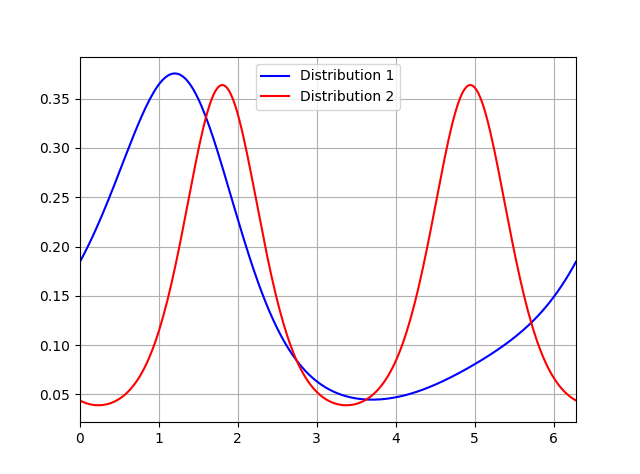

# binprism.PPD
**`binprism.PPD(log_pdf_coef)`** <br />
**log_pdf_coef (binprism.FourierSeries):** *Fourier Series of the distribution's log-pdf* <br />

The `PPD` class is a periodic probability distribution defined by the Fourier coefficients of its log-pdf. When created, the coefficients of the log-pdf are adjusted so the area under one period of the `PPD` is equal to one.

## Attributes
**log_pdf_coef (binprism.FourierSeries):** *Fourier Series of the distribution's log-pdf* <br />
**L:** *Alias of* `log_pdf_coef` <br />
**moments (binprism.MomentCalculator):** *Circular moments of the distribution* <br/>
**m:** *Alias of* `moments`

## Methods
[cdf](cdf.md) <br />
[disp](disp.md) <br />
[mean](mean.md) <br />
[pdf](pdf.md) <br />
[quantile](quantile.md) <br />
[sim](sim.md) <br />
[var](var.md)

## Examples
```
>>> fs1 = bp.FourierSeries([-2, 0.3 - 0.4j, -0.1])
>>> dist1 = bp.PPD(fs1) #DC coefficient of the Fourier series will be modified so that the total area equals one
>>> dist1
f(x) = exp(-2.0897052036655333 + (0.6)cos(x) + (0.8)sin(x) + (-0.2)cos(2x) + (-0.0)sin(2x))
>>> fs2 = bp.FourierSeries([-2, 0, -0.5 + 0.25j]) #No influence of first harmonic on log-pdf
>>> dist2 = bp.PPD(fs2)
>>> x = np.linspace(0, 2*np.pi, 250)
>>> plt.plot(x, dist1.pdf(x), color = 'b', label = "Distribution 1")
>>> plt.plot(x, dist2.pdf(x), color = 'r', label = "Distribution 2")
>>> plt.grid(True)
>>> plt.xlim(0, 2*np.pi)
>>> plt.legend(loc = 'best')
>>> plt.show()
```
