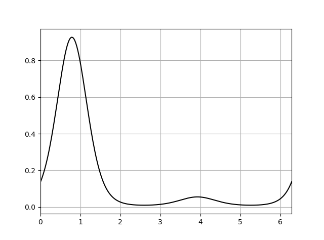
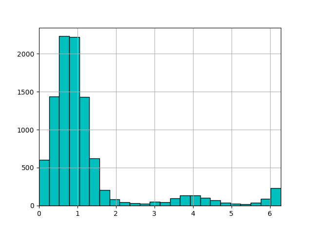

# binprism.PPD.sim
**`PPD.sim(N, **kwargs)`** <br />
Simulates `N` angles following the distribution by simulating N random values between 0 and 1 and then evaluating the quantile function

## Parameters
**N (int):** *Number of angles to simulate* <br />
**kwargs:** *Additional arguments for evaluating the [quantile](quantile.md) function (tol, max_iter, n_interpolation_points)*

## Returns
**angles (numpy.array):** *Simulated angles*

## Examples
```
>>> fs = bp.FourierSeries([-2, 0.5 - 0.5j, -0.75j])
>>> dist = bp.PPD(fs)
>>> plt.plot(theta, dist.pdf(theta), color = 'k')
>>> plt.grid(True)
>>> plt.xlim(0, 2*np.pi)
>>> plt.show()
```

```
>>> N = 10000
>>> sim_data = dist.sim(N)
>>> theta = np.linspace(0, 2*np.pi, 250)
>>> plt.hist(sim_data, bins = np.linspace(0, 2*np.pi, 25), facecolor = 'c', edgecolor = 'k')
>>> plt.grid(True)
>>> plt.xlim(0, 2*np.pi)
>>> plt.show()
```
