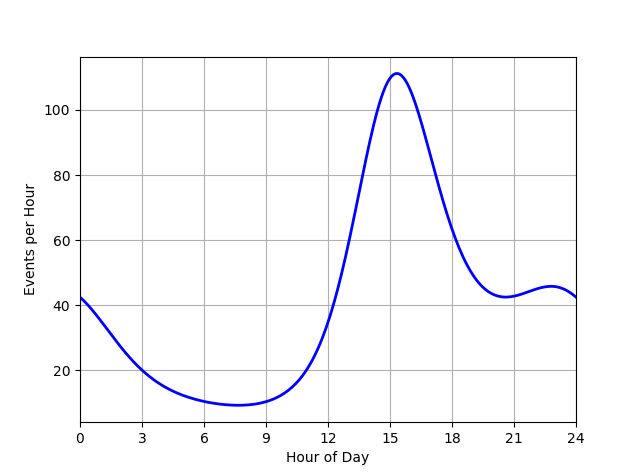

# binprism.Profile
**`binprism.Profile(dist, total, time_range)`** <br />
**dist (binprism.PPD):** *Probability distribution that events follow* <br />
**total (numeric):** *Total number of events* <br />
**time_range (tuple):** *Length-2 tuple indicating the start and end times of one period of events* <br />
A profile of events distributed throughout a time period, such as events throughout the day or year.

## Attributes
**dist (binprism.PPD):** *Probability distribution that events follow* <br />
**total (numeric):** *Total number of events* <br />
**time_range (tuple):** *Length-2 tuple indicating the start and end times of one period of events* <br />
**mean_time (float):** *Mean time that events occur in the units defined by* `time_range`

## Methods
[angle2time](angle2time.md) <br />
[count_events](count_events.md) <br />
[eval](eval.md) <br />
[plot](plot.md) <br />
[shift](shift.md) <br />
[sim](sim.md) <br />
[time2angle](time2angle.md) <br />
[time2hhmm](time2hhmm.md) <br />

## Example
```
>>> fs = bp.FourierSeries([-2, 0.5j, 0.1 - 0.2j, 0.05 + 0.05j])
>>> dist = bp.PPD(fs)
>>> total_events = 1000
>>> time_range = (0, 24)
>>> profile = bp.Profile(dist, total_events, time_range)
>>> profile
binprism.Profile
Total Events: 1000.0
Time Range:  (0, 24)
Mean Time: 17.137893225691656
PDF: f(x) = exp(-2.1182135495889716 + (0.0)cos(x) + (-1.0)sin(x) + (0.2)cos(2x) + (0.4)sin(2x) + (0.1)cos(3x) + (-0.1)sin(3x))
>>> profile.plot(N = 250, color = 'b', linewidth = 2)
>>> plt.xticks(range(0, 25, 3))
>>> plt.xlabel('Hour of Day')
>>> plt.ylabel('Events per Hour')
>>> plt.grid(True)
>>> plt.xlim(time_range)
>>> plt.show()
```

