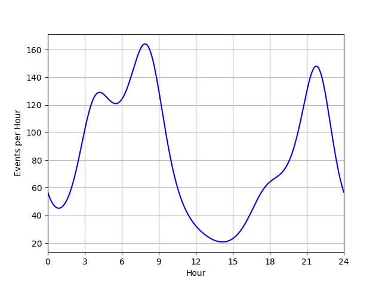
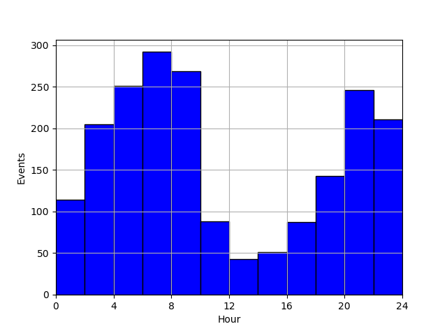
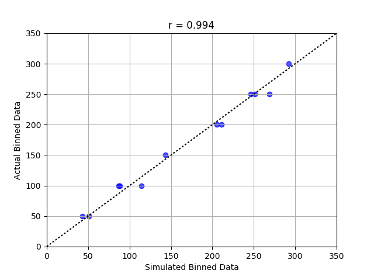

# binprism.Profile.sim
**`Profile.sim(N, **kwargs)`** <br />
Simulates `N` random events following the profile's underlying distribution but converted to the profile's time units

## Parameters
**N (int):** *Number of events to simulate* <br />
**kwargs:** *Keyword arguments for evaluating the [quantile](https://github.com/JoeJimFlood/binprism/blob/master/doc/PPD/quantile.md) function*

## Returns
**events (length-N numpy.array):** *Simulated events*

## Example
```
>>> data = [100, 200, 250, 300, 250, 100, 50, 50, 100, 150, 250, 200]
>>> bins = range(0, 24, 2)
>>> profile = bp.fit(data, bins, 5, (0, 24))
>>> profile.plot(288, color = 'b')
>>> plt.xlim(profile.time_range)
>>> plt.xticks(range(0, 25, 3))
>>> plt.xlabel('Hour')
>>> plt.ylabel('Events per Hour')
>>> plt.grid(True)
>>> plt.show()
```

```
>>> sim_data = profile.sim(profile.total)
>>> binned_sim_data = plt.hist(sim_data, list(bins) + [24], facecolor = 'b', edgecolor = 'k')[0]
>>> plt.xlim(profile.time_range)
>>> plt.xticks(range(0, 25, 4))
>>> plt.xlabel('Hour')
>>> plt.ylabel('Events')
>>> plt.grid(True)
>>> plt.show()
```

```
>>> from scipy.stats import pearsonr
>>> plt.scatter(binned_sim_data, data, color = 'b', alpha = 0.7)
>>> plt.plot([0, 350], [0, 350], color = 'k', linestyle = ':')
>>> plt.xlim(0, 350)
>>> plt.ylim(0, 350)
>>> plt.xticks(range(0, 400, 50))
>>> plt.yticks(range(0, 400, 50))
>>> plt.xlabel('Simulated Binned Data')
>>> plt.ylabel('Actual Binned Data')
>>> plt.title('r = {}'.format(round(pearsonr(data, binned_sim_data)[0], 3)))
>>> plt.grid(True)
>>> plt.show()
```
