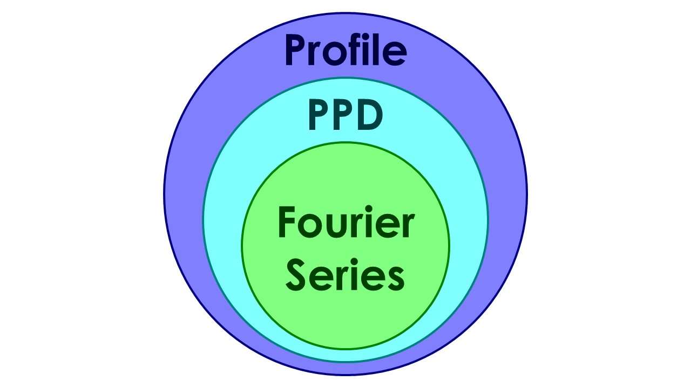
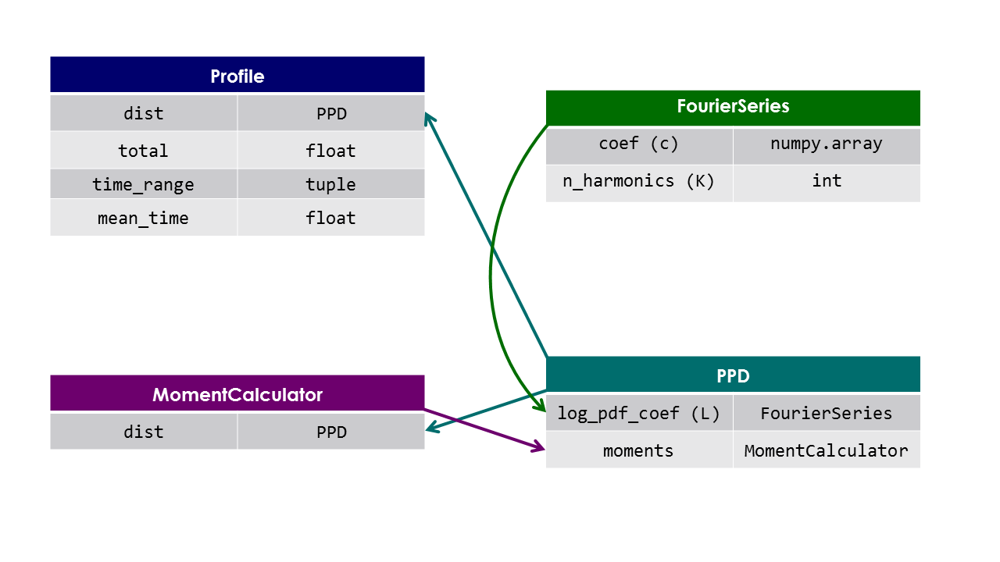

# Data Structure
BinPrism uses nested classes. The most basic class is the [FourierSeries](FourierSeries/FourierSeries.md). This object contains a NumPy array of the zero and positive-indexed components of a Fourier series (the negative-indexed components are derived using complex conjugation). The next class up is the [PPD](PPD/PPD.md) (periodic probability distribution), which is defined by the Fourier coefficients of its log-pdf, expressed as a `FourierSeries` instance. `PPD` objects also have a [MomentCalculator](MomentCalculator/MomentCalculator.md), which is used to calculate circular moments of the distribution. The final, primary class in BinPrism is that of the [Profile](Profile/Profile.md), which is a `PPD` along with a total number of events and a range of times over which the events take place. The [fit](fit.md) method creates a `Profile` from input binned data using the algorithm described [here](methodology.md).

## Descriptions of BinPrism Classes and Their Methods*
[FourierSeries](FourierSeries/FourierSeries.md)  
[PPD](PPD/PPD.md)  
[MomentCalculator](MomentCalculator/MomentCalculator.md)  
[Profile](Profile/Profile.md)  

*In all examples of methods, [NumPy](http://www.numpy.org/) and [Matplotlib](https://matplotlib.org/).pyplot are imported as `np` and `plt`, respectively.
