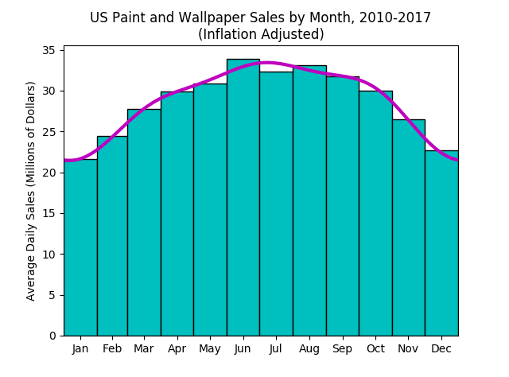

# Electronics Sales
According to the US Census Bureau's [Monthly Retail Trade](https://www.census.gov/retail/index.html#mrts) statistics, the average monthly electronics sales in billions of [January 2018$](https://www.bls.gov/data/inflation_calculator.htm) from 2010-2017 are as follows:

|Month    |Sales|
|---------|----:|
|January  |670  |
|February |685  |
|March    |861  |
|April    |897  |
|May      |958  |
|June     |1016 |
|July     |1003 |
|August   |1025 |
|September|952  |
|October  |929  |
|November |794  |
|December |702  |

A profile for the following data can be fit using the following commands:
```
>>> import calendar
>>> sales = np.array([670, 685, 861, 897, 958, 1016, 1003, 1025, 952, 929, 794, 702])
>>> month_lengths = np.array([0, 31, 28, 31, 30, 31, 30, 31, 31, 30, 31, 30])
>>> month_lengths2 = np.array(list(month_lengths[1:]) + [31])
>>> month_starts = np.cumsum(month_lengths)
>>> month_labels = calendar.month_abbr[1:13]
>>> n_harmonics = 3
>>> sales_profile = bp.fit(sales, month_starts, n_harmonics, (0, 365))
>>> plt.bar(month_starts, sales/month_lengths2, month_lengths2, align = 'edge', facecolor = 'c', edgecolor = 'k')
>>> sales_profile.plot(365, color = 'm', linewidth = 3)
>>> plt.xlim(sales_profile.time_range)
>>> plt.xticks(month_starts + 0.5*month_lengths2, month_labels)
>>> plt.ylabel('Average Daily Sales (Millions of Dollars)')
>>> plt.title('US Paint and Wallpaper Sales by Month, 2010-2017\n(Inflation Adjusted)')
>>> plt.show()
```
<<<<<<< HEAD

Using the fit profile, estimate the 2018 weekly paint and wallpaper sales between Memorial Day (May 29) and Labor Day (September 3)

