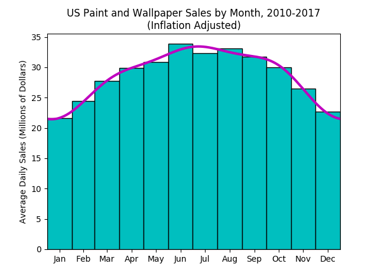

# Electronics Sales
According to the US Census Bureau's [Monthly Retail Trade](https://www.census.gov/retail/index.html#mrts) statistics, the average monthly electronics sales in millions of [January 2018$](https://www.bls.gov/data/inflation_calculator.htm) from 2010-2017 are as follows:

|Month    |Sales|
|---------|----:|
|January  |670  |
|February |685  |
|March    |861  |
|April    |897  |
|May      |958  |
|June     |1016 |
|July     |1003 |
|August   |1025 |
|September|952  |
|October  |929  |
|November |794  |
|December |702  |

A profile for the following data can be fit using the following commands:
```
>>> import calendar
>>> sales = np.array([670, 685, 861, 897, 958, 1016, 1003, 1025, 952, 929, 794, 702])
>>> month_lengths = np.array([0, 31, 28, 31, 30, 31, 30, 31, 31, 30, 31, 30])
>>> month_lengths2 = np.array(list(month_lengths[1:]) + [31])
>>> month_starts = np.cumsum(month_lengths)
>>> month_labels = calendar.month_abbr[1:13]
>>> n_harmonics = 3
>>> sales_profile = bp.fit(sales, month_starts, n_harmonics, (0, 365))
>>> plt.bar(month_starts, sales/month_lengths2, month_lengths2, align = 'edge', facecolor = 'c', edgecolor = 'k')
>>> sales_profile.plot(365, color = 'm', linewidth = 3)
>>> plt.xlim(sales_profile.time_range)
>>> plt.xticks(month_starts + 0.5*month_lengths2, month_labels)
>>> plt.ylabel('Average Daily Sales (Millions of Dollars)')
>>> plt.title('US Paint and Wallpaper Sales by Month, 2010-2017\n(Inflation Adjusted)')
>>> plt.show()
```
 <br />
Using the fit profile, estimate the 2018 weekly paint and wallpaper sales between President's Day (Feb 19) and Memorial Day (May 29)
```
>>> Feb19 = month_starts[1] + 18 #Month start numbers are zero-indexed
>>> May29 = month_starts[4] + 28
>>> weekly_sales = sales_profile[Feb19:May29:7]
>>> weekly_sales
array([ 176.84111625,  182.92940754,  188.69914159,  193.92119388,
        198.45801334,  202.27563516,  205.43809072,  208.0857512 ,
        210.40288854,  212.58140537,  214.78719134,  217.13374721,
        219.66567345,  222.35307329])
```
Now add some labels
```
>>> from datetime import datetime, timedelta
>>> week_starts = []
>>> startdate = datetime(2018, 2, 19)
>>> for i in range(14):
...     week_starts.append(startdate.strftime('%b%d'))
...     startdate += timedelta(days = 7)
>>> import pandas as pd
>>> weekly_sales_with_labels = pd.Series(weekly_sales, index = week_starts)
>>> weekly_sales_with_labels
Feb19    176.841116
Feb26    182.929408
Mar05    188.699142
Mar12    193.921194
Mar19    198.458013
Mar26    202.275635
Apr02    205.438091
Apr09    208.085751
Apr16    210.402889
Apr23    212.581405
Apr30    214.787191
May07    217.133747
May14    219.665673
May21    222.353073
dtype: float64
```
