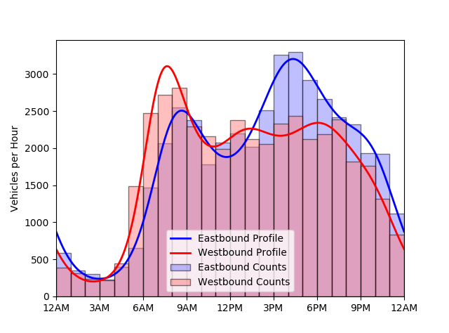
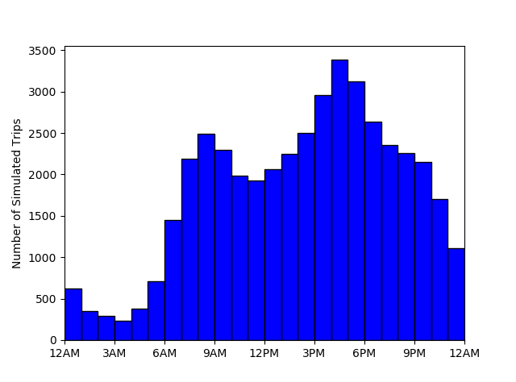
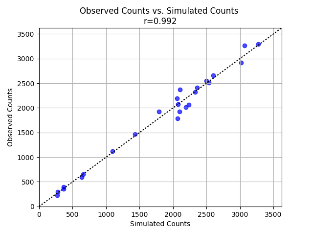

# Traffic Counts
Traffic counts available from the [Delaware Valley Regional Planning Commission](https://www.dvrpc.org/webmaps/TrafficCounts/). </br>
</br>
The following were the hourly traffic volumes on the Benjamin Franklin Bridge between Philadelphia, Pennsylvania and Camden, New Jersey on Thursday, March 12, 2015:

|Hour     |Eastbound Counts|Westbound Counts
|---------|---------------:|---------------:|
|12AM-1AM |590             |387             |
|1AM-2AM  |353             |316             |
|2AM-3AM  |301             |237             |
|3AM-4AM  |230             |219             |
|4AM-5AM  |393             |442             |
|5AM-6AM  |655             |1491            |
|6AM-7AM  |1469            |2472            |
|7AM-8AM  |2067            |2716            |
|8AM-9AM  |2549            |2809            |
|9AM-10AM |2375            |2294            |
|10AM-11AM|1783            |2159            |
|11AM-12PM|2076            |1991            |
|12PM-1PM |2193            |2380            |
|1PM-2PM  |2017            |2119            |
|2PM-3PM  |2513            |2052            |
|3PM-4PM  |3262            |2333            |
|4PM-5PM  |3294            |2434            |
|5PM-6PM  |2915            |2122            |
|6PM-7PM  |2657            |2188            |
|7PM-8PM  |2412            |2385            |
|8PM-9PM  |2323            |1821            |
|9PM-10PM |1928            |1760            |
|10PM-11PM|1925            |1314            |
|11PM-12PM|1118            |836             |

The following code fits profiles to match the data:
```
>>> eb_counts = [590, 353, 301, 230, 393, 655, 1469, 2067, 2549, 2375, 1783, 2076, 
...              2193, 2017, 2513, 3262, 3294, 2915, 2657, 2412, 2323, 1928, 1925, 1118]
>>> wb_counts = [387, 316, 237, 219, 442, 1491, 2472, 2716, 2809, 2294, 2159, 1991,
...              2380, 2119, 2052, 2333, 2434, 2122, 2188, 2385, 1821, 1760, 1314, 836]
>>> hours = list(range(24))
>>> n_harmonics = 6
>>> time_range = (0, 24)
>>> eb_profile = bp.fit(eb_counts, hours, n_harmonics, time_range)
>>> wb_profile = bp.fit(wb_counts, hours, n_harmonics, time_range)
>>> plt.bar(hours, eb_counts, 24*[1], align = 'edge', alpha = 0.5,
...         facecolor = '#8080ff', edgecolor = 'k', label = 'Eastbound Counts')
>>> plt.bar(hours, wb_counts, 24*[1], align = 'edge', alpha = 0.5,
...         facecolor = '#ff8080', edgecolor = 'k', label = 'Westbound Counts')
>>> eb_profile.plot(288, color = 'b', linewidth = 2, label = 'Eastbound Profile')
>>> wb_profile.plot(288, color = 'r', linewidth = 2, label = 'Westbound Profile')
>>> plt.xlim(0, 24)
>>> plt.ylabel('Vehicles per Hour')
>>> plt.xticks(list(range(0, 25, 3)),
...            [eb_profile.time2hhmm(i % 24) for i in range(0, 25, 3)],
...            rotation = 15)
>>> plt.legend(loc = 'best')
>>> plt.show()
```
 </br>
Now estimate 15-minute counts between 5 and 10 AM.
```
>>> import pandas as pd
>>> from datetime import datetime, timedelta
>>> times = []
>>> start_time = datetime(2018, 3, 12, 5)
>>> for i in range(20):
...     times.append(start_time.strftime('%H:%M'))
...     start_time += timedelta(minutes = 15)
>>> eb_15min_counts = eb_profile[5:10:0.25]
>>> wb_15min_counts = wb_profile[5:10:0.25]
>>> counts_15min = pd.DataFrame({'Start Time': times, 'Eastbound': eb_15min_counts, 'Westbound': wb_15min_counts})
>>> counts_15min = counts_15min.set_index('Start Time')
>>> counts_15min
             Eastbound   Westbound
Start Time                        
05:00       128.482043  223.203079
05:15       152.721965  289.143493
05:30       183.557068  368.050324
05:45       221.887822  455.916214
06:00       268.113731  545.592935
06:15       321.726568  627.940606
06:30       380.927259  694.101211
06:45       442.451057  737.993034
07:00       501.797725  757.862657
07:15       553.951137  756.247465
07:30       594.447508  738.595594
07:45       620.431938  711.380852
08:00       631.290699  680.524276
08:15       628.626162  650.509693
08:30       615.645282  624.154903
08:45       596.264953  602.793503
09:00       574.276280  586.622360
09:15       552.783625  575.063426
09:30       533.961696  567.082003
09:45       519.055301  561.457083
```
Finally, simulate a day of Eastbound counts.
```
>>> sim_trips = eb_profile.sim(int(eb_profile.total))
>>> sim_trips[:12]
array([ 11.50349476,  20.52060506,  13.91631843,  21.31057433,
         8.45089883,   7.98107033,  18.32463815,  15.70342346,
        17.47518339,  12.8519406 ,  18.55525178,   8.77008476])
>>> plt.hist(sim_trips, 24, facecolor = 'b', edgecolor = 'k')
>>> plt.xlim(0, 24)
>>> plt.xticks(list(range(0, 25, 3)),
...            [eb_profile.time2hhmm(i%24) for i in range(0, 25, 3)],
...            rotation = 15)
>>> plt.ylabel('Number of Simulated Trips')
>>> plt.show()
```
 </br>
Compare with observed counts.
```
>>> from scipy.stats import pearsonr
>>> sim_counts = np.histogram(sim_trips, 24)[0]
>>> (r, p) = pearsonr(sim_counts, eb_counts)
>>> plot_range = (0, 1.1*max(max(eb_counts), max(sim_counts)))
>>> plt.scatter(sim_counts, eb_counts, color = 'b', alpha = 0.7)
>>> plt.plot(plot_range, plot_range, color = 'k', linestyle = ':')
>>> plt.xlabel('Simulated Counts')
>>> plt.ylabel('Observed Counts')
>>> plt.xlim(plot_range)
>>> plt.ylim(plot_range)
>>> plt.grid(True)
>>> plt.title('Observed Counts vs. Simulated Counts \nr={}'.format(round(r, 3)))
>>> plt.show()
```

