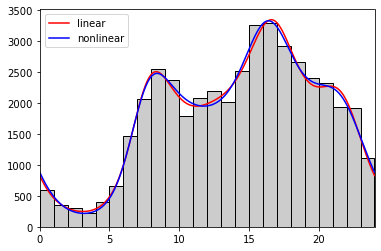
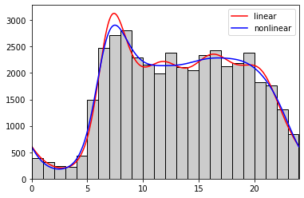

# Traffic Counts with Optimization
The new feature in version 1.0.1 is allowing for the fit profiles to be enhanced using a [nonlinear optimization algorithm](https://docs.scipy.org/doc/scipy/reference/generated/scipy.optimize.minimize.html). This will be demonstrated using the same data in the [traffic counts](TrafficCounts.md) example.

```
>>> eb_counts = [590, 353, 301, 230, 393, 655, 1469, 2067, 2549, 2375, 1783, 2076,
...              2193, 2017, 2513, 3262, 3294, 2915, 2657, 2412, 2323, 1928, 1925, 1118]
>>> wb_counts = [387, 316, 237, 219, 442, 1491, 2472, 2716, 2809, 2294, 2159, 1991,
...              2380, 2119, 2052, 2333, 2434, 2122, 2188, 2385, 1821, 1760, 1314, 836]
>>> hours = list(range(24))
>>> n_harmonics = 5
>>> time_range = (0, 24)
```
The following code fits profiles only by solving linear systems of equations.
```
eb_profile_linear = bp.fit(eb_counts, hours, n_harmonics, time_range)
wb_profile_linear = bp.fit(wb_counts, hours, n_harmonics, time_range)
```
These next lines of code fit profiles using nonlinear optimization, with the linear solutions as initial guesses.
```
eb_profile_nonlinear = bp.fit(eb_counts, hours, n_harmonics, time_range, optimize = True)
wb_profile_nonlinear = bp.fit(wb_counts, hours, n_harmonics, time_range, optimize = True)
```
Plotting the profiles along with the counts can show the improvement in the profiles by using the nonlinear optimizer.
```
>>> plt.bar(range(24), eb_counts, width = 1, align = 'edge', edgecolor = 'k', facecolor = '#cccccc')
>>> eb_profile_linear.plot(1440, color = 'r', label = 'linear')
>>> eb_profile_nonlinear.plot(1440, color = 'b', label = 'nonlinear')
>>> plt.xlim(0, 24)
>>> plt.legend(loc = 'best')
>>> plt.show()
```

```
>>> plt.bar(range(24), wb_counts, width = 1, align = 'edge', edgecolor = 'k', facecolor = '#cccccc')
>>> wb_profile_linear.plot(1440, color = 'r', label = 'linear')
>>> wb_profile_nonlinear.plot(1440, color = 'b', label = 'nonlinear')
>>> plt.xlim(0, 24)
>>> plt.legend(loc = 'best')
>>> plt.show()
```


The counts can be re-estimated from the profiles using the following code. Correlations between the actual and estimated counts from the linear and nonlinear profiles can then be calculated.
```
>>> eb_counts_linear = eb_profile_linear[range(25)]
>>> eb_counts_nonlinear = eb_profile_nonlinear[range(25)]
>>> wb_counts_linear = wb_profile_linear[range(25)]
>>> wb_counts_nonlinear = wb_profile_nonlinear[range(25)]
```
|Direction|Linear|Nonlinear|
|---------|-----:|--------:|
|Eastbound|0.990 |0.991    |
|Westbound|0.986 |0.990    |
