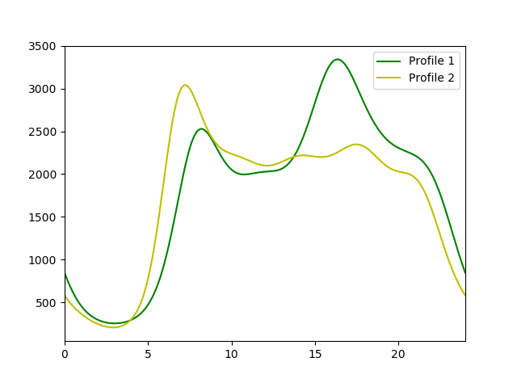

# binprism.load.csv
**`binprism.load.csv(fp)`** <br />
Read in profiles from csv with information on them

## Parameters
**fp (str):** *Filepath to read from. Must be a table containing the columns specified in [load.df()](load_df.md)*

## Example
[Input](BinPrismCSVExample.csv)
```
>>> profiles = bp.load.csv('BinPrismCSVExample.csv')
>>> profiles[0].plot(288, color = 'g', label = 'Profile 1')
>>> profiles[1].plot(288, color = 'y', label = 'Profile 2')
>>> plt.xlim(profiles[0].time_range)
>>> plt.legend(loc = 'best')
>>> plt.show()
```

