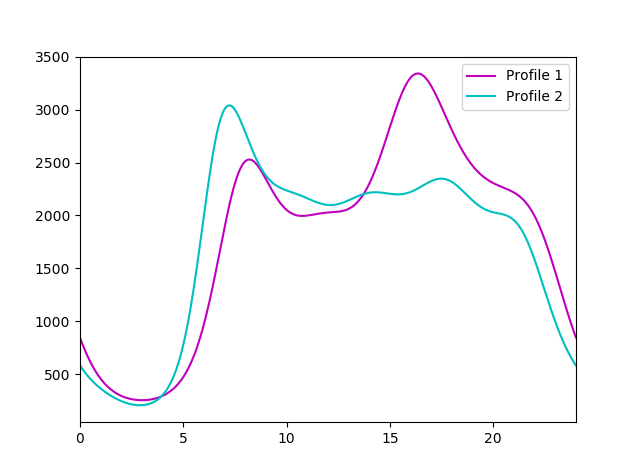

# binprism.load.txt
**`binprism.load.txt(fp)`** <br />

Read in profiles from a text file encoded in the same way as the outputs of [save.txt()](save_txt.md)

## Parameters
**fp (str):** *Filepath to read*

## Example
[Input](BinPrismTXTExample.txt)
```
>>> profiles = bp.load.txt('BinPrismTXTExample.txt')
>>> profiles[0].plot(288, color = 'm', label = 'Profile 1')
>>> profiles[1].plot(288, color = 'c', label = 'Profile 2')
>>> plt.xlim(profiles[0].time_range)
>>> plt.legend(loc = 'best')
>>> plt.show()
```

